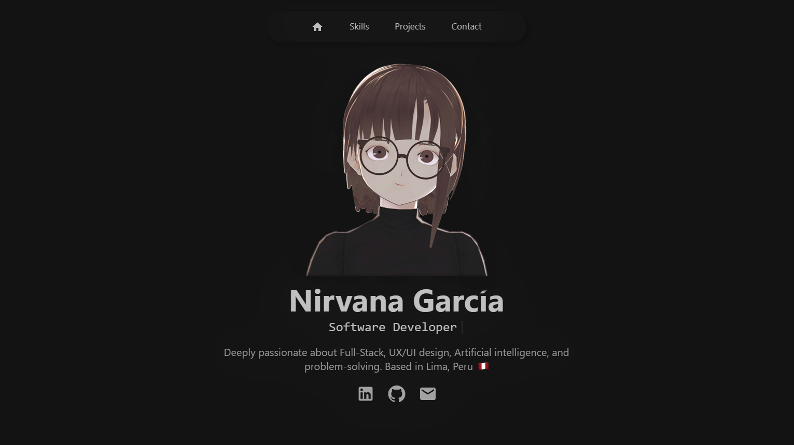

# Welcome to My Portfolio! 


## 🛠 Run it locally

1. Install dependencies

```sh
   npm install
```

2. Run the application
```sh
   npm start
```

<br>

## 💻 Tech Stack
`React.js`
`Javascript`
`CSS`
`HTML`


<br>

> Now you can enjoy! 

<br>

